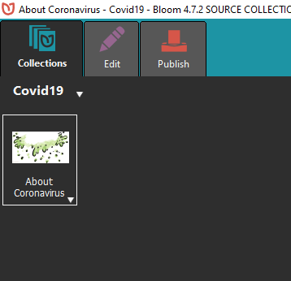
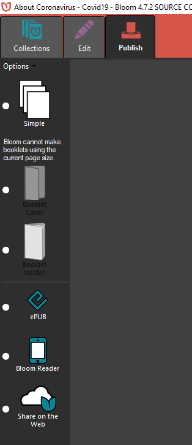
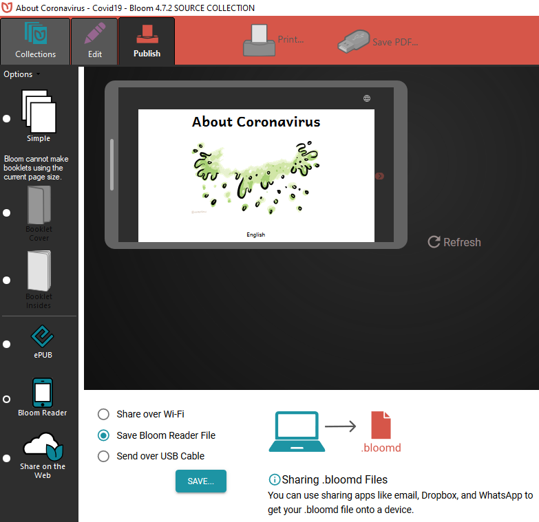
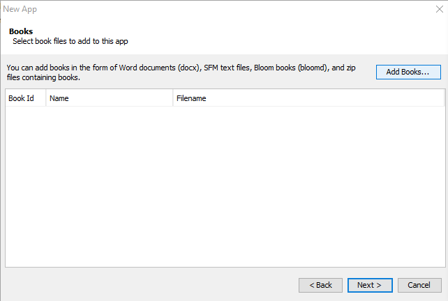
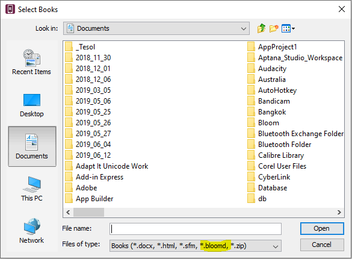

# Using Bloom books in SAB/RAB 7 and above

With version 7 of SAB and RAB, the Bloom Reader is included in the app. So the way things work when you build it in Bloom, it should work the same way in SAB/RAB.

## Step 1 -- Get a Bloomd file from Bloom.

- Select the book you want
  
- Choose Publish
  
- Choose the **Bloom Reader** option on the left.
  
- Choose the Save **loom Reader File** option
- Click **Save**
- Choose the folder you want to save to and click **Save**

## Step 2 -- Import your *.bloomd* file into SAB/RAB

- When you get to the **Books** dialog, click **Add Books** button
  
- In the **Select Books** dialog you will see that *.bloomd files will be visible.
  
- Select the **.bloomd** file you created and click **Open**