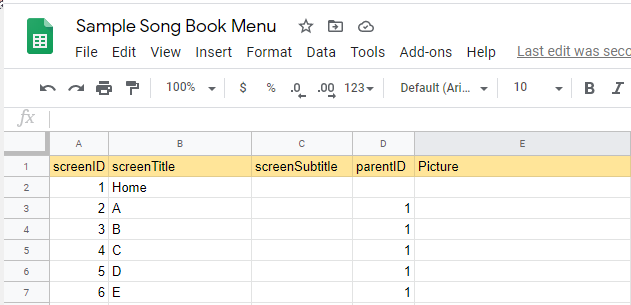

# Building a Contents menu for SAB and RAB from Google Sheet

This method uses a Google Sheet to organize the data used to create the Menu. However you could use a pair of Tab separated variable files if you have some other way of editing them.

## Setting up the Google Sheet

To have a Google sheet you need a Google Account. I have tried using Spread Sheet programs but 1) they are not shareable and 2) they don't give clean *tab separated variable* text output.

### screens tab
The first tab is the **screens** tab. It has 5 columns.



- Column 1 is the **screenID** You must have a unique identifier in this column, I use numbers.
- Column 2 is the **screenTitle** You must have the title in this column, in this case it is Home then a series of Alphabet characters to group the songs.
- Column 3 is **screenSubtitle** this is optional
- Column 4 is **parentID** this is required except for the home screen.
- Column 5 is **Picture** this is optional. It is the place you can put unique images for each title. Not normally used for a song book.

### items tab

The second tabe is the items tab where you fill in the destinations of the item. This has 9 columns.


- Column 1 is the **itemTitle** this contains the title to appear in the menu.
- Column 2 is the **itemSubtitle** this contains the subtitle if needed.
- Column 3 is the **parentID** this references the line to the **screen** it should appear on from the screens tab.
- Column 4 is the **targetType** this says what type of link it has, In this case all **reference** types
- Column 5  is the **CollectionID** this is only needed if using SAB and having different collections.
- Column 6  is the **BookID** this is the ID of the book. If importing SFM you may have a book ID if from Word it will be assigned like B001, etc.
- Column 7  is the **Chapter** this is ususally the song number of the song in the book. For Song books it is not optional
- Column 8  is the **Verse** this is not needed for a songbook.
- Column 9  is the **Picture** this is optional but is most often not used in songbooks.

## Setting up Xrunner

### Download and install Xrunner

- Download the latest version of Xrunner from [https://github.com/SILAsiaPub/xrunner/releases](https://github.com/SILAsiaPub/xrunner/releases)
- Install Xrunner. It is not signed so you have to take a risk.
- If you are using SAB or RAB then Java should be properly installed.
- Download the files from [https://github.com/SILAsiaPub/xrunner/tree/master/_xrunner_projects/TSV-Menu_maker/Songbook_example](https://github.com/SILAsiaPub/xrunner/tree/master/_xrunner_projects/TSV-Menu_maker/Songbook_example)
  - In the _xrunner_projects folder create a new folder. Name it with no spaces in the name.
  - In that folder put the project.txt file and a folder called **scripts** containg the **RAB-contents-menu-xml-from-tsv-v4.xslt** file
  
### Update the xrun.ini file

- Java should already be on your computer since you have SAB or RAB installed.
- For this project you need to have a command line zipping program installed and a reference to it in you xrun.ini or in you project.txt [variables] section.
  For example I use 7Zip so have an entry in my xrun.ini
  ```
  zip=C:\Program Files\7-Zip\7z.exe
  ```
  
## Creating the Menu to upload

- Download your two sheets from Google Sheets.
  - File > Download > Tab separated values for each sheet.
  - Rename the two files as screens.tsv and items.tsv and add to the source subfolder in your project folder.
- Start Xrunner from your Start menu Publishing > Xrunner.
- Click on the button [1. Click here to select your project folder]
- Select the project you set up.
- Check the box, **Pause at the end of tasks?**
- Click the button [Make contents menu]
- If all went well you should have a file called contents.zip in the output folder that has been created in your project.
- If you see any red in the command prompt box, something went wrong. It may give some messages to report.

## In SAB or RAB upload the file created.

- In your App Builder, go to the ##Contents menu## section
- Remove any menu items there or export then remove all menu items and screens.
- Import the contents.zip you created from your spread sheet data.