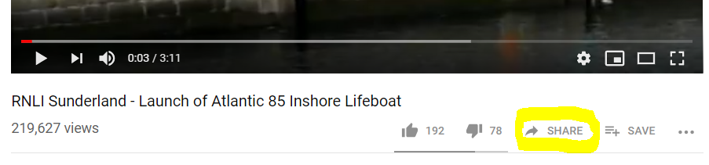
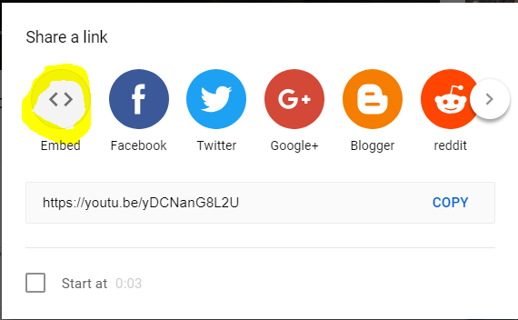
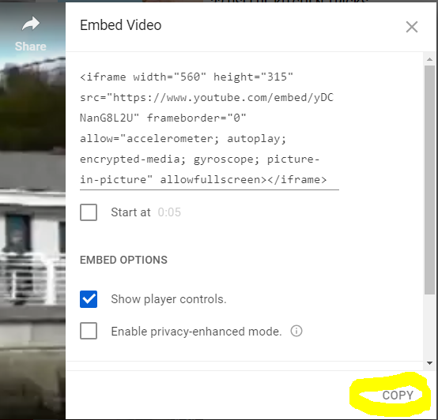
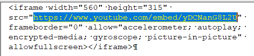
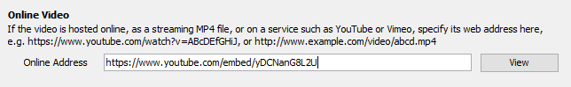

## Getting a YouTube link

- [Readme](README.md)

If you are using a **YouTube** online video, here are the steps to get the direct video link.

1. Click on the Share link (circled in bright yellow).
 

1. Click on the **Embed** link (circled in bright yellow).
 

1.  Click the **COPY** button in the bottom right corner (circled in bright yellow). 
 

1. Paste the Embed text into a text editor (NotePad) and just select and copy the equivalent part  to what is highlighted in blue. The part after the **`src="`** and before the next double quote **`"`**. It may wrap onto a second line if your editor window is small.
 

1. Now in **SAB** In the **Video** section click **Add Video...** button and paste the video source link into the **Online Video** box.
 

This technique can be used for other sources too, it will look a bit different.

[Checking Internet setting for Online Video](CheckInternetPermission.md)
